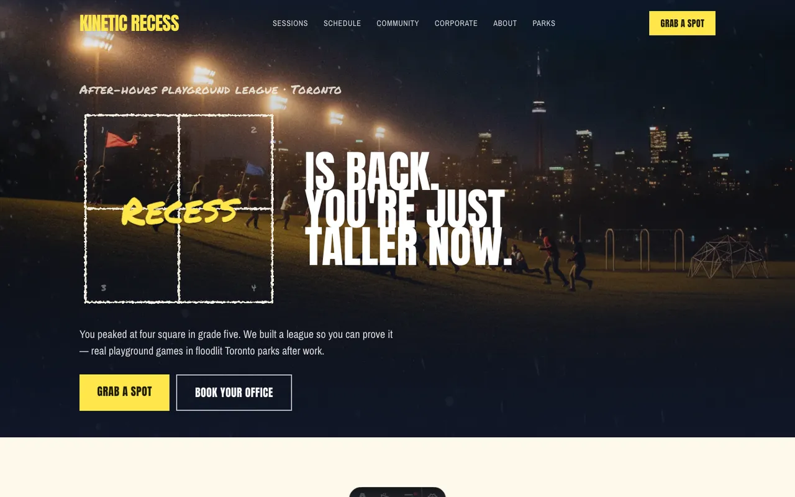

# Kinetic Recess

> Playground fitness for adults who miss recess.

A Toronto outfit running adult recess sessions in school playgrounds after hours —
dodgeball, four square, capture the flag, and structured arguing about the rules.
Corporate bookings fund free community nights.

**Live:** [kineticrecess.com](https://kineticrecess.com)



---

## Stack

- **[Astro 5](https://astro.build)** (server output) with **React islands**
- **[Tailwind CSS v4](https://tailwindcss.com)** for styling
- **[Wix Headless](https://dev.wix.com/docs/go-headless)** — `@wix/sdk`, `@wix/data` (CMS), `@wix/astro`
- Deployed on Wix (`*.wix-site-host.com` + custom domain)

## Features

- **7 pages** — Home, Session Types, Schedule, Community Nights, Corporate, How Recess Works, Find a Park
- **Reservations** — every session/community card opens an accessible `<dialog>` that captures a spot and persists to the CMS
- **Corporate inquiry form** — persists to the CMS; ready to trigger emails via Wix Automations
- **CMS-backed** — `Reservations` and `CorporateInquiries` collections (content currently seeded from `src/data/site.ts`)
- **SEO** — per-page JSON-LD (SportsActivityLocation, SportsEvent, Service, FAQPage)
- **Fast & accessible** — Lighthouse **94 mobile / 98 desktop**; WebP imagery, self-hosted preloaded fonts, `prefers-reduced-motion` honored, semantic landmarks, visible focus, 44px tap targets

## Design

"After-dark blacktop" — cinematic floodlit photography over midnight navy, with a chalk
layer (four-square hero, hand-drawn dividers, referee annotations) as the signature device.

- **Display:** Anton (the "scoreboard") + Permanent Marker (the chalk/human voice)
- **Body:** Archivo Narrow · **Accent:** Caveat
- **Palette:** midnight navy `#11192e`, warm chalk-paper `#fdf9ea`, chalk-yellow `#ffe74c` (reserved for CTAs, wordmark, and the hero word)

## Quick start

```bash
npm install
npx wix env pull        # pull Wix credentials into .env.local (or copy .env.example)
npm run dev             # http://localhost:4321
```

Build & deploy:

```bash
npx wix build
npx wix release         # prints the live URL
```

## Project structure

```
src/
  data/site.ts            # all content (sessions, nights, reviews, FAQ, parks, story)
  styles/global.css       # Tailwind v4 @theme: palette, fonts, scrims, chalk animations
  layouts/Layout.astro    # <head>, SEO/JSON-LD, header/footer/sticky-bar/reserve-modal
  components/             # Header, Footer, SessionCard, ReserveModal, ChalkNote, Icon, …
  pages/                 # index, sessions, schedule, community, corporate, about, parks
  pages/api/             # reservation.ts, corporate-inquiry.ts (write to Wix CMS)
public/images/            # floodlit playground photography (WebP)
public/fonts/             # self-hosted woff2 subsets
```

See [`SETUP.md`](SETUP.md) for build notes, the CMS schema, and the email-automation setup.

---

🤖 Built with [Claude Code](https://claude.com/claude-code).
